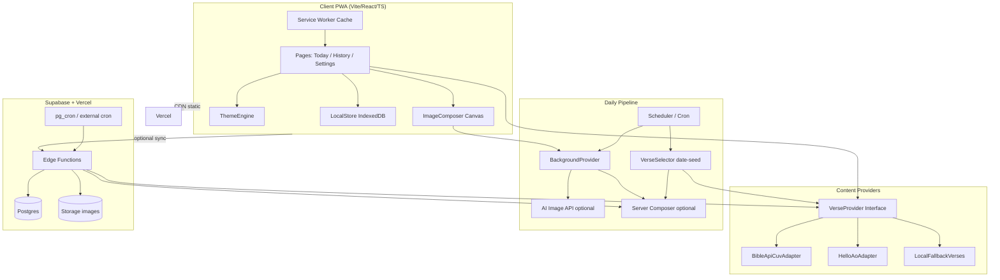

# 「金句日」技术架构文档

| 字段 | 内容 |
|------|------|
| 版本 | v0.1 |
| 前端 | Vite + React 19 + TypeScript（strict）PWA |
| 后端/任务 | Supabase Edge Functions + Cron（后期） |
| 部署 | Vercel（前端）+ Supabase（数据/定时） |
| 目标规模 | 架构按百万用户可水平扩展设计；MVP 单区域低成本 |

---

## 1. 系统架构图

### 1.1 逻辑架构（Mermaid）



### 1.2 请求流（今日金句）

```
用户打开 /
  → load preferences (LocalStore)
  → VerseOfDayService.get(date, tz, translation)
       → 若 Cloud 有缓存：GET /v1/verse-of-day?date=
       → 否则：VerseProvider.fetch + 本地确定性选题
  → BackgroundProvider.resolve(theme, date)
  → ImageComposer.compose({ verse, theme, template, size })
  → 展示 + 可导出 PNG
  → 写入 GeneratedImage 本地记录
```

### 1.3 每日自动生成（生产目标）

```
Cron 00:05 UTC+8
  → Edge Function generate-daily
  → 选题（全局默认池）
  → 生成/选取背景
  → 可选服务端渲染多尺寸
  → 写入 verse_of_day + storage
  → 客户端打开时优先拉取 CDN 资产（省客户端算力）
```

MVP：**客户端确定性生成**（无后端也可运行）；接口形状与云端对齐，便于无缝切换。

---

## 2. 核心模块划分

| 模块 | 职责 | 不负责 |
|------|------|--------|
| **VerseProvider** | 按译本取经文；统一 `Verse` DTO | UI、画布 |
| **VerseSelector** | 按日期种子从池/API 选「今日」 | 画图 |
| **ThemeEngine** | 颜色、字体、模板、背景风格参数 | 拉经文 |
| **BackgroundProvider** | 返回背景（纯色/渐变/图 URL/AI） | 叠字 |
| **ImageComposer** | Canvas 叠字、版式、导出 Blob | 选题业务 |
| **ImageGenerator** | 编排：verse+theme+bg → composed image | 页面路由 |
| **Scheduler** | 日级触发（本地 midnight / 云 Cron） | 业务规则细节 |
| **LocalStore** | 偏好、历史、收藏 | 远程权威数据 |
| **ShareService** | Web Share / 下载 | 生成 |
| **Telemetry**（预留） | 匿名事件 | PII |

### 2.1 模块依赖方向（单向）

```
pages → services/image-generator → composer + background + theme
                 ↘ verse-selector → verse-provider
pages → local-store
pages → share-service
```

禁止：composer 依赖 React 组件；provider 依赖 UI。

---

## 3. 数据模型

### 3.1 领域类型（TypeScript 概念）

```ts
// 圣经经文（不可变内容）
interface Verse {
  id: string;              // e.g. "John.3.16@cuv"
  reference: string;       // "约翰福音 3:16"
  referenceEn?: string;    // "John 3:16"
  text: string;            // 经文正文
  translation: TranslationCode;
  book: string;
  chapter: number;
  verseStart: number;
  verseEnd?: number;
  source: "bible-api" | "helloao" | "local";
}

type TranslationCode = "cuv" | "cunps" | "esv" | "niv" | string;

// 每日金句记录
interface VerseOfDay {
  id: string;              // `${date}_${translation}_${poolVersion}`
  date: string;            // YYYY-MM-DD (user tz)
  verse: Verse;
  themeId: string;
  templateId: string;
  createdAt: string;       // ISO
}

// 生成图
interface GeneratedImage {
  id: string;
  verseOfDayId: string;
  width: number;
  height: number;
  templateId: string;
  themeId: string;
  blobKey?: string;        // idb key
  remoteUrl?: string;
  createdAt: string;
}

// 视觉主题
interface Theme {
  id: string;
  name: string;
  colors: {
    bg: string;
    fg: string;
    muted: string;
    accent: string;
    meta: string;
  };
  fonts: {
    verse: string;         // CSS font-family
    meta: string;
  };
  backgroundStyle: BackgroundStyle;
  overlay: {
    scrim: number;         // 0-1 暗/亮遮罩
    textShadow: string;
  };
}

type BackgroundStyle =
  | { type: "gradient"; css: string }
  | { type: "image"; url: string }
  | { type: "ai"; promptKey: string; seed?: number };

// 版式模板
interface LayoutTemplate {
  id: string;
  name: string;
  layout: "center" | "top-bottom" | "left-right" | "vertical-rl";
  paddingRatio: number;
  verseFontSizeRange: [number, number]; // px at 1080 ref
  maxLines: number;
}

// 用户偏好
interface UserPreferences {
  translation: TranslationCode;
  themeId: string;
  defaultSize: "story" | "square" | "landscape";
  defaultTemplateId: string;
  reduceMotion: boolean;
  notifyEnabled: boolean;
  timezone: string;
}

// 收藏
interface CollectionItem {
  id: string;
  verseId: string;
  verseOfDayId?: string;
  note?: string;
  createdAt: string;
}

// 用户（后期）
interface User {
  id: string;
  email?: string;
  displayName?: string;
  preferences: UserPreferences;
  createdAt: string;
}
```

### 3.2 Supabase 表（后期）

```sql
-- verse_of_day: 全局每日缓存
-- generated_assets: 多尺寸 URL
-- themes: 远程主题包
-- user_profiles / user_collections
```

MVP 仅 LocalStore，表结构预留不强制迁移。

---

## 4. 扩展性设计

### 4.1 新增主题

1. 在 `src/themes/registry.ts` 增加 `Theme` 对象  
2. 可选增加背景资源  
3. **不改** ImageComposer 算法（读 theme tokens）  

### 4.2 新增译本

1. 实现 `VerseProvider`：`fetchVerse(ref)` / `getVerseOfDayCandidate(date)`  
2. 注册到 `providers/index.ts`  
3. 偏好里增加选项  

### 4.3 新增 AI 功能

```
ReflectionService.generate(verse) → Reflection
// 独立模块；UI 新入口；Feature flag
```

Image 管道不因 AI 对话而改接口。

### 4.4 新增 AI 背景

实现 `BackgroundProvider` 的 `AiBackgroundAdapter`：

```ts
interface BackgroundProvider {
  resolve(input: { theme: Theme; date: string; size: Size }): Promise<BackgroundLayer>;
}
```

### 4.5 百万用户要点

| 点 | 策略 |
|----|------|
| 经文 API 限流 | 服务端聚合缓存；客户端本地池 |
| 图片生成 CPU | 日级预生成 + CDN；客户端仅换模板时本地合成 |
| 存储 | 图片进对象存储；DB 只存元数据 |
| 边缘 | Vercel/Supabase 多区域后续再开 |
| 成本 | AI 图按日生成一张全局底图，用户侧叠不同主题字色 |

---

## 5. 技术栈清单 + 低成本方案

| 层级 | 选型 | 费用策略 |
|------|------|----------|
| 前端 | Vite, React, TypeScript, Tailwind | 免费 |
| 路由 | wouter 或 react-router | 免费 |
| PWA | vite-plugin-pwa | 免费 |
| 本地 DB | idb (IndexedDB) | 免费 |
| 经文 | bible-api.com / helloao + 本地 JSON | 免费档 |
| 画布 | Canvas 2D | 免费 |
| 字体 | 思源宋体/黑体（npm 子集或 CDN） | 免费 OFL |
| 后端 | Supabase Free → Pro | 先 Free |
| 定时 | Supabase Cron / GitHub Actions | 免费档 |
| AI 图 | 可选 Replicate/SD；MVP 渐变+静态资源 | 按量 |
| 部署 | Vercel Hobby | 免费 |
| 监控 | Vercel Analytics 可选 | 免费档 |

### 5.1 图像生成双路径

1. **MVP**：`Gradient/Noise Background` + Canvas 文字（零 API 成本，可运行）  
2. **生产**：日更 AI 背景 URL + 同一 Composer  

---

## 6. 部署方案（Vercel + Supabase）

```
GitHub repo
  → Vercel: build `pnpm build`, output dist, SPA fallback
  → env: VITE_SUPABASE_URL, VITE_SUPABASE_ANON_KEY (后期)
  → Supabase: Edge Function `generate-daily` + Storage bucket `verse-images`
  → Cron: 每天调用 Edge Function
```

### 6.1 环境变量（预留）

```
VITE_DEFAULT_TRANSLATION=cuv
VITE_BIBLE_API_BASE=https://bible-api.com
VITE_SUPABASE_URL=
VITE_SUPABASE_ANON_KEY=
VITE_ENABLE_AI_BG=false
```

### 6.2 目录与边界

- `apps/web` 或根目录前端（MVP 单包）  
- `supabase/functions` 后期  
- `docs/` 产品与架构  
- `scripts/` 种子数据  

---

## 7. 安全与合规

- 无密钥进前端仓库  
- AI Key 仅 Edge Function  
- CSP 限制脚本源  
- 用户内容最小化  

---

## 8. 测试策略

| 层 | 内容 |
|----|------|
| 单元 | VerseSelector 日期稳定性、换行算法、主题 resolve |
| 组件 | Today 页渲染经文 |
| 视觉 | 导出图人工抽检 checklist |
| e2e | 可选 Playwright：打开→下载 |

---

## 9. 里程碑与模块门禁

| 模块 | 交付 | 门禁 |
|------|------|------|
| M0 | PRD + 架构 | 文档评审 |
| M1 | 项目初始化可 `pnpm dev` | 白屏消失，严格 TS |
| M2 | VerseProvider + ImageGenerator | 能导出一张图 |
| M3 | 今日/历史/分享/设置 | 主路径可走通 |
| M4 | PWA + 云定时 | 可安装、可日更 |
