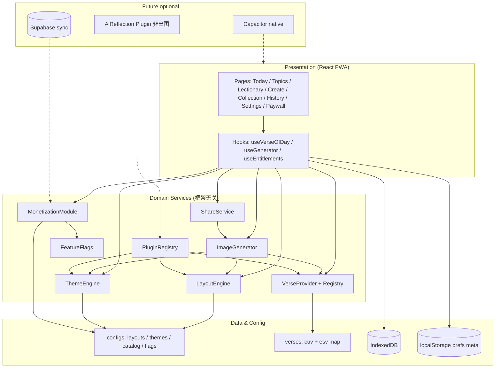
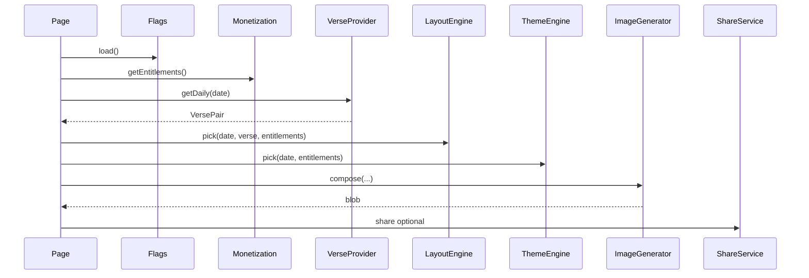

# 「金句日」技术架构文档 — 阶段2

| 字段 | 内容 |
|------|------|
| 阶段 | **阶段2：技术架构 · 模块划分 · 文件夹结构** |
| 版本 | v2.0-phase2 |
| 前置 | 阶段1 PRD 已确认（`docs/PRD_V2_PHASE1.md`） |
| 状态 | 待确认（确认后进入阶段3：本地图像生成管道 + 多版式） |
| 技术基线 | Vite + React 19 + TypeScript strict · PWA · 本地 Canvas |

---

## 0. 阶段1确认纪要（锁定）

| 决策项 | 取值 |
|--------|------|
| 英文默认译本 | **ESV**（可切换 NIV） |
| 版式权益 | **6 免费 + 6 付费（高级）** |
| 免费水印 | **「金句日」** 小字；付费可去品牌水印，出处/译本永不去 |
| 自定义经文成图 | **Plus 权益**（`verse.custom`） |
| 出图主管道 | **本地 Canvas**，禁止外部付费 AI 图 API 作为默认 |

---

## 1. 系统架构总览

### 1.1 逻辑架构（Mermaid）



### 1.2 生成主路径（无 AI）

```
User opens Today
  → FeatureFlags + Entitlements
  → VerseProvider.getDaily(date, { zh: cuv, en: esv })
  → LayoutEngine.pick(date, verse, prefs, entitlements)
  → ThemeEngine.pick(date, prefs, entitlements)
  → ImageGenerator.compose({ versePair, layout, theme, size, watermark })
       → BackgroundPainter (gradient / local asset)
       → TextComposer (zh primary, en secondary)
       → Meta + Watermark
  → PNG Blob → preview / ShareService / optional IDB thumb
```

### 1.3 依赖方向（单向）

```
pages/hooks
  → services (generator, share, monetization)
    → engines (layout, theme, verse)
      → providers/plugins
        → configs + pure utils (hash, geometry)
```

**禁止**：engines 依赖 React；ImageGenerator 依赖具体 Page；Monetization 修改经文正文。

---

## 2. 核心模块划分

### 2.1 模块表

| 模块 | 路径（目标） | 职责 |
|------|----------------|------|
| **hash** | `src/core/hash.ts` | 日期种子哈希 |
| **VerseProvider** | `src/core/verse/` | 经文获取、双语 pair、每日选题 |
| **LayoutEngine** | `src/core/layout/` | 版式注册、智能选择、布局度量 |
| **ThemeEngine** | `src/core/theme/` | 主题注册、日主题选择 |
| **ImageGenerator** | `src/core/image/` | 编排 Canvas 合成与导出 |
| **ShareService** | `src/core/share/` | 多尺寸、系统分享、文案 |
| **StorageService** | `src/core/storage/` | prefs / history / collection / idb |
| **MonetizationModule** | `src/core/monetization/` | 权益、目录、水印策略、Mock 解锁 |
| **FeatureFlags** | `src/core/flags/` | 功能开关 |
| **PluginRegistry** | `src/core/plugins/` | 插件注册与发现 |
| **Scheduler** | `src/core/scheduler/` | 时区日界、今日 key |
| **Lectionary** | `src/core/lectionary/` | 三代经课 |
| **Topics** | `src/core/verse/topics.ts` | 主题/九果 |

### 2.2 核心接口定义（TypeScript 契约）

```ts
// —— Verse ——
interface VerseLocale {
  text: string;
  reference: string;
  translation: 'cuv' | 'esv' | 'niv' | string;
}

interface VersePair {
  id: string;
  book: string;
  chapter: number;
  verseStart: number;
  verseEnd?: number;
  zh: VerseLocale;          // 主：和合本
  en?: VerseLocale;         // 副：ESV/NIV
  topics?: string[];
  source: string;
}

interface VerseProvider {
  readonly id: string;
  getByReference(ref: string, langs: { zh: string; en?: string }): Promise<VersePair>;
  getDaily(date: string, opts: DailyVerseOpts): Promise<VersePair>;
  getPool?(filter?: VerseFilter): Promise<VersePair[]>;
}

// —— Layout ——
interface LayoutDefinition {
  id: string;
  name: string;
  version: number;
  tier: 'free' | 'premium';
  engine: 'center' | 'center-quote' | 'top-stack' | 'bottom-card'
    | 'left-rail' | 'right-panel' | 'split-bilingual' | 'verse-focus'
    | 'vertical-rl' | 'corner-meta' | 'dual-column' | 'minimal-line';
  // 数据驱动参数
  paddingRatio: number;
  zhFontRange: [number, number];
  enFontRatio: number;      // 相对中文
  maxLinesZh: number;
  bilingual: 'stack' | 'split' | 'footnote' | 'none';
  lengthHint: 'short' | 'medium' | 'long' | 'any';
}

interface LayoutEngine {
  list(): LayoutDefinition[];
  resolve(id: string): LayoutDefinition;
  pick(input: {
    date: string;
    verse: VersePair;
    bilingualMode: 'zh-en' | 'zh' | 'en';
    entitlements: EntitlementSet;
  }): LayoutDefinition;
}

// —— Theme ——
interface ThemeDefinition {
  id: string;
  name: string;
  tier: 'free' | 'premium';
  colors: { bg: string; fg: string; muted: string; accent: string; meta: string };
  fonts: { verse: string; meta: string };
  background: { type: 'gradient' | 'texture'; spec: string };
  overlay: { scrim: number; textShadow: string };
}

interface ThemeEngine {
  list(): ThemeDefinition[];
  resolve(id: string): ThemeDefinition;
  pick(date: string, entitlements: EntitlementSet, prefId?: string): ThemeDefinition;
}

// —— Image ——
interface ComposeRequest {
  verse: VersePair;
  layout: LayoutDefinition;
  theme: ThemeDefinition;
  size: { name: string; width: number; height: number };
  date: string;
  bilingualMode: 'zh-en' | 'zh' | 'en';
  watermark: WatermarkPolicy;
}

interface ImageGenerator {
  compose(req: ComposeRequest): Promise<{ blob: Blob; dataUrl: string; width: number; height: number }>;
}

// —— Share ——
interface ShareService {
  buildCaption(verse: VersePair, mode: 'zh-en' | 'zh' | 'en'): string;
  share(input: { blob: Blob; filename: string; caption: string }): Promise<'shared' | 'downloaded' | 'copied'>;
  download(blob: Blob, filename: string): Promise<void>;
}

// —— Monetization ——
type Entitlement =
  | 'watermark.off'
  | 'layouts.premium'
  | 'themes.premium'
  | 'verse.custom'
  | 'sync.cloud'
  | 'ads.off';

interface MonetizationModule {
  getEntitlements(): EntitlementSet;
  isEntitled(e: Entitlement): boolean;
  getCatalog(): Product[];
  /** V1 Mock；V2 接 IAP/Stripe */
  unlock(productId: string): Promise<void>;
  getWatermarkPolicy(): WatermarkPolicy;
}

interface WatermarkPolicy {
  showBrand: boolean;       // 「金句日」
  brandText: string;
  alwaysShowCitation: boolean; // 永远 true
}

// —— Plugin ——
interface JinjuPlugin {
  id: string;
  version: string;
  activate(ctx: PluginContext): void | Promise<void>;
}

interface PluginContext {
  registerVerseProvider(p: VerseProvider): void;
  registerLayout(l: LayoutDefinition): void;
  registerTheme(t: ThemeDefinition): void;
  // 后期: registerShareTarget, registerReflection...
}
```

### 2.3 模块交互时序（今日）



---

## 3. 数据模型

### 3.1 领域

| 实体 | 说明 |
|------|------|
| `VersePair` | 中英对照经文原子 |
| `VerseOfDay` | date + versePair + layoutId + themeId + createdAt |
| `LayoutDefinition` | 版式配置（含 tier） |
| `ThemeDefinition` | 主题配置（含 tier） |
| `GeneratedAssetMeta` | 宽高、layout、theme、无 blob |
| `UserPreferences` | 语言模式、译本、尺寸、autoLayout、时区 |
| `CollectionItem` / `HistoryEntry` | 本地元数据 |
| `EntitlementSet` | 用户已购权益 |
| `Product` | 商品目录项 |

### 3.2 配置文件（数据驱动）

```
configs/
  layouts/
    L01-center.json
    L02-center-quote.json
    ...
    L12-minimal-line.json
  themes/
    dawn.json
    night.json
    ...
  monetization/
    catalog.json          # 商品与 entitlement 映射
    free-grants.json      # 免费默认权益
  flags/
    default.json
  share/
    presets.json          # story/square/landscape
```

### 3.3 经文数据

```
src/data/
  verses-cuv-seed.json      # 中文主池
  verses-esv-map.json       # id/reference → 英文（V1 对照表）
  lectionary-readings.json
  verse-topics 可继续 TS 映射
```

### 3.4 持久化

| 存储 | 内容 |
|------|------|
| localStorage | preferences、entitlements mock、history/collection **元数据** |
| IndexedDB (idb-keyval) | 可选缩略图、英文缓存、大型配置缓存 |
| 禁止 | localStorage 存 PNG base64 |

---

## 4. 版式与权益映射（落地表）

| Layout | tier | V1 实现优先级 |
|--------|------|----------------|
| L01 center | free | P0 |
| L02 center-quote | free | P0 |
| L03 top-stack | free | P0 |
| L04 bottom-card | free | P0 |
| L05 left-rail | free | P0 |
| L06 right-panel | free | P0 |
| L07 split-bilingual | premium | P0（双语核心）*或 free 若强调双语 |
| L08 verse-focus | premium | P1 |
| L09 vertical-rl | premium | P1 |
| L10 corner-meta | premium | P1 |
| L11 dual-column | premium | P1 |
| L12 minimal-line | premium | P1 |

**修订建议（与双语定位一致）**：L07 `split-bilingual` 划为 **free**，保证免费用户完整体验双语；付费侧重 L08–L12 设计向版式 + 去水印 + 主题包。

| 锁定后免费版式 | L01–L07（7 个）略超 6 → 取 **L01–L06 free，L07–L12 premium**，双语在 L01–L06 内用 stack/footnote 完整支持 |
| 付费版式 | L07–L12 |

（与阶段1「约 6+6」对齐：**free L01–L06，premium L07–L12**。）

---

## 5. 扩展点说明

| 扩展点 | 如何加 | 不改什么 |
|--------|--------|----------|
| 新版式 | 加 `configs/layouts/Lxx.json` + engine 分支或通用约束求解 | Page UI |
| 新主题包 | 加 theme json + `tier: premium` | Generator 接口 |
| 新经文源 | `VerseProvider` 实现 + PluginRegistry | Layout |
| 新译本 | map 文件 + provider 参数 | 叠字核心 |
| 支付 | MonetizationModule.purchase 真实现 | 经文内容 |
| AI 默想 | 独立 Plugin，输出 string，不进 Image 主管道 | Canvas 管道 |
| 原生 App | Capacitor 包一层 WebView | 领域层 |

### 5.1 插件生命周期

```
app boot
  → load core configs
  → PluginRegistry.activateAll()
  → providers/engines ready
  → render UI
```

---

## 6. 盈利技术预留

### 6.1 catalog 示例

```json
{
  "products": [
    {
      "id": "plus_yearly",
      "title": "金句日 Plus 年费",
      "entitlements": ["watermark.off", "layouts.premium", "themes.premium", "verse.custom"],
      "priceDisplay": "¥68/年"
    },
    {
      "id": "pack_easter",
      "title": "复活期主题包",
      "entitlements": ["themes.premium"],
      "priceDisplay": "¥12"
    }
  ]
}
```

### 6.2 转化触点（实现位置）

| 触点 | 行为 |
|------|------|
| 生成完成 | 免费显示水印；设置项「去水印」→ Paywall |
| 版式选择器 | premium 项带锁标，可预览一次 |
| Create 页 | 无 `verse.custom` 时引导 Plus |
| 不出现 | 读经中全屏强制广告 |

### 6.3 V1 实现范围（阶段5）

- `MonetizationModule` + localStorage entitlements  
- `unlockMock`  
- 水印绘制  
- Paywall 页 UI（无真支付）  

---

## 7. 目标文件夹结构

```
jinju-ri/
├── docs/
│   ├── PRD_V2_PHASE1.md
│   ├── ARCHITECTURE_V2_PHASE2.md    ← 本文件
│   └── ...
├── configs/                         # 数据驱动（可热更新形态）
│   ├── layouts/
│   ├── themes/
│   ├── monetization/
│   ├── flags/
│   └── share/
├── public/
│   ├── fonts/                       # 可选子集
│   └── textures/                    # 可选本地背景
├── src/
│   ├── main.tsx
│   ├── App.tsx
│   ├── vite-env.d.ts
│   ├── styles/
│   ├── pages/
│   │   ├── TodayPage.tsx
│   │   ├── TopicsPage.tsx
│   │   ├── LectionaryPage.tsx
│   │   ├── CreatePage.tsx
│   │   ├── CollectionPage.tsx
│   │   ├── HistoryPage.tsx
│   │   ├── SettingsPage.tsx
│   │   └── PaywallPage.tsx          # 阶段5
│   ├── components/
│   │   ├── VerseStudio.tsx
│   │   ├── LayoutPicker.tsx
│   │   └── ...
│   ├── hooks/
│   │   ├── useVerseOfDay.ts
│   │   ├── useImageGenerator.ts
│   │   └── useEntitlements.ts
│   ├── core/
│   │   ├── hash.ts
│   │   ├── types.ts                 # 领域类型汇总
│   │   ├── verse/
│   │   │   ├── types.ts
│   │   │   ├── registry.ts
│   │   │   ├── local-cuv-provider.ts
│   │   │   ├── bilingual.ts
│   │   │   ├── selector.ts
│   │   │   ├── topics.ts
│   │   │   └── custom.ts
│   │   ├── layout/
│   │   │   ├── engine.ts
│   │   │   ├── picker.ts
│   │   │   └── engines/             # 各 layout engine 实现
│   │   ├── theme/
│   │   │   ├── engine.ts
│   │   │   └── registry.ts
│   │   ├── image/
│   │   │   ├── generator.ts
│   │   │   ├── composer.ts
│   │   │   ├── background.ts
│   │   │   ├── text.ts
│   │   │   └── watermark.ts
│   │   ├── share/
│   │   │   ├── service.ts
│   │   │   └── captions.ts
│   │   ├── storage/
│   │   ├── monetization/
│   │   │   ├── module.ts
│   │   │   ├── catalog.ts
│   │   │   └── entitlements.ts
│   │   ├── flags/
│   │   ├── plugins/
│   │   │   ├── registry.ts
│   │   │   └── types.ts
│   │   ├── lectionary/
│   │   └── scheduler/
│   └── data/
│       ├── verses-cuv-seed.json
│       ├── verses-esv-map.json
│       └── lectionary-readings.json
├── package.json
├── tsconfig.json
├── vite.config.ts
└── README.md
```

### 7.1 与当前仓库关系

现有 `src/core/*` 已具备雏形。阶段3–6 将：

1. **收敛接口**到本文契约  
2. **抽离 LayoutEngine**（从 template 枚举升级为配置 + 12 engine）  
3. **补齐双语 VersePair**  
4. **ShareService / Monetization** 独立目录  
5. **configs/** 数据驱动迁出硬编码  

不推倒重来，采用 **渐进重构**。

---

## 8. 技术栈清单（阶段2锁定）

| 层 | 选型 |
|----|------|
| 语言 | TypeScript strict + noUncheckedIndexedAccess |
| UI | React 19 + Vite 6 |
| 路由 | wouter |
| PWA | vite-plugin-pwa |
| 本地 KV | idb-keyval（图/缓存）+ localStorage（prefs） |
| 样式 | CSS 变量 + 现有 global（可逐步 token 化） |
| 测试 | 阶段3+ 为 hash/picker/wrapText 加 vitest（可选） |
| 部署 | Vercel 静态；后期 Capacitor |

---

## 9. 非功能需求

| 项 | 目标 |
|----|------|
| 离线 | 今日生成全链路离线可用 |
| 性能 | 中端机 1080×1920 生成 < 500ms 目标 |
| 可访问 | 主按钮可键盘操作；减少动效尊重 prefers-reduced-motion |
| 隐私 | V1 默认无账号、无上传经文图 |
| 安全 | 无密钥进前端；支付仅服务端/IAP（V2） |

---

## 10. 阶段2 验收清单

- [x] 架构图（逻辑 + 时序）  
- [x] 模块职责与依赖方向  
- [x] 核心接口（Verse / Layout / Theme / Image / Share / Monetization / Plugin）  
- [x] 数据模型与配置布局  
- [x] 12 版式与 free/premium 映射  
- [x] 扩展点与盈利预留  
- [x] 目标文件夹结构与渐进迁移说明  

---

## 11. 阶段门禁

| 状态 | 说明 |
|------|------|
| **当前** | 阶段2 文档完成，**等待确认** |
| 下一阶段 | **阶段3**：本地图像生成管道 + 多版式系统（核心可运行代码） |

---

**请确认阶段2**（回复「阶段2确认」即可）。  
确认后开始阶段3：在现有项目上落地 LayoutEngine、扩版式至 ≥8、强化自动日更版式与本地生成管道（仍不用 AI）。
