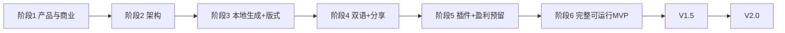

# 「金句日」产品需求文档（PRD）— 阶段1

| 字段 | 内容 |
|------|------|
| 产品名 | 金句日（Jinju Day） |
| 文档阶段 | **阶段1：产品定义 · 商业模式 · 扩展性设计** |
| 版本 | v2.0-phase1 |
| 状态 | 待确认（确认后进入阶段2：技术架构） |
| 形态 | Web PWA → Capacitor App（后期） |
| 生成原则 | **本地生成**（Canvas / OffscreenCanvas）；禁止付费 AI 图像 API 作为主管道 |
| 日期 | 2026-07-15 |

---

## 1. 产品愿景与一句话定位

### 1.1 愿景

让华语与双语基督徒，在每日节奏中安静领受一句圣经话语；并以**可离线、可分享、版式日日不同**的高品质金句图，把默想带进生活与社交场景——同时保持敬虔、克制，不做成瘾内容产品。

### 1.2 一句话定位

**「金句日」是一款本地自动生成、每日版式变化、中英双语的圣经金句图片 App，帮助人安静在神面前，并优雅地分享真道。**

### 1.3 产品原则（硬约束）

| # | 原则 | 说明 |
|---|------|------|
| P1 | 本地生成主管道 | 浏览器 Canvas / 可选本地服务；AI 绘图不得作为默认/必需 |
| P2 | 每日版式不同 | ≥8–12 种布局模板；按日期种子 + 主题智能选择，同日可复现 |
| P3 | 中英双语 | 中文主（和合本），英文副（ESV/NIV 可切换），可关英文 |
| P4 | 主流社交可分享 | 多尺寸导出 + 系统分享 + 文案模板 |
| P5 | 高度可扩展 | 模块化 + 插件化 + 数据驱动配置 |
| P6 | 盈利不伤害属灵 | 付费卖「美与便利」，不卖「属灵特权」或操控经文 |

### 1.4 明确「不是什么」

- 不是社交网络、教会管理系统  
- 不是鸡汤励志滤镜工厂  
- 不是依赖外部 AI 绘图的订阅工具  
- 不是断章取义的「算命式经文」产品  

---

## 2. 目标用户画像

### 画像 A：安静默想型 — 「晨更的小美」

| 维度 | 描述 |
|------|------|
| 画像 | 25–45 岁华语基督徒，重视灵修节奏 |
| 场景 | 清晨 5–15 分钟；安静读一句经文 |
| 痛点 | 信息流打扰；自己做图费时；讨厌商业感设计 |
| 诉求 | 打开即见今日金句图；离线可用；版式庄重 |
| 付费意愿 | 中：愿为无水印、高级主题付小额年费 |

### 画像 B：双语分享型 — 「团契的 Alex / 阿华」

| 维度 | 描述 |
|------|------|
| 画像 | 华语 + 英语环境（教会、留学生、跨文化家庭） |
| 场景 | 微信/IG/Stories/小组群分享 |
| 痛点 | 难找中英对照且好看、正统的金句图；版权与译本不清晰 |
| 诉求 | 中英同图、一键分享、多平台尺寸 |
| 付费意愿 | 高：高级版式包、双语无水印、自定义经文 |

### 画像 C：习惯养成与收藏型 — 「长老建中 / 姊妹美玲」

| 维度 | 描述 |
|------|------|
| 画像 | 35–60 岁；重视连续读经与收藏 |
| 场景 | 每日打开、回顾历史、主题/九果/经课 |
| 痛点 | 碎片化无节奏；想按主题回顾 |
| 诉求 | 每日稳定、历史收藏、主题与经课 |
| 付费意愿 | 中低：同步多设备、Widget、主题包 |

### 2.1 用户分层与价值

```
免费层：养成「每日打开 → 看见 → 偶尔分享」习惯
   ↓
轻度付费：去水印 / 高级主题（视觉愉悦）
   ↓
深度付费：自定义、多译本、跨设备同步、Widget
```

---

## 3. MVP 功能清单 vs 后期扩展

### 3.1 MVP（V1.0）— 必须可运行

| ID | 功能 | 优先级 | 备注 |
|----|------|--------|------|
| M01 | 今日金句（日期种子稳定） | Must | 同日可复现 |
| M02 | **本地自动生成金句图** | Must | Canvas 主管道 |
| M03 | **每日自动轮换版式**（≥8 种，目标 12） | Must | 日期种子 + 可手动改 |
| M04 | 视觉主题（≥5 套本地） | Must | 渐变/本地纹理背景 |
| M05 | **中英双语显示** | Must | 中：和合本；英：ESV 或 NIV（可用本地对照表/公开源） |
| M06 | 双语开关与主副语言偏好 | Must | 仅中 / 中+英 / 仅英（可选） |
| M07 | 多尺寸导出 | Must | 故事 1080×1920、方 1080×1080、横 1920×1080 |
| M08 | 保存 PNG + 系统分享 | Must | Web Share API + 下载回退 |
| M09 | 社交文案模板 | Must | 带出处与译本 |
| M10 | 历史（元数据，不存大图） | Must | 避免 localStorage 配额问题 |
| M11 | 收藏 | Must | 本地 |
| M12 | 主题筛选 + 圣灵九果 | Should | 已有基础，纳入 V1 |
| M13 | 三代经课精简 | Should | 本地表 |
| M14 | 设置（版式自动、语言、尺寸） | Must | |
| M15 | 免费水印策略 | Must | 免费层小字「金句日」；付费可去 |
| M16 | 扩展/盈利配置开关（Feature Flag） | Must | 代码预留，UI 可弱展示 |

### 3.2 明确不做（V1）

- 外部付费 AI 出图作为默认  
- 完整 RCL 三年全文库  
- 真实支付收银台（仅预留模块与 Mock）  
- 社群 feed、私信  
- 账号强制登录  

### 3.3 后期扩展（V1.5 / V2.0）

| 阶段 | 功能 |
|------|------|
| V1.5 | 主题商城（配置包）、高级版式包、去水印 IAP、自定义经文、IndexedDB 缩略图缓存、PWA 安装引导 |
| V2.0 | Supabase 同步、Widget、多译本完整源、经课完整库、温和 AI **默想文案**（非改经、非出图）、社群精选墙、Capacitor 双端、Stripe/IAP 真支付 |

---

## 4. 每日不同版式的设计原则（规划 12 种）

### 4.1 设计原则

1. **可读第一**：任何版式中文必须清晰；英文为副，字号约为中文 55–70%。  
2. **同日稳定**：`hash(date + salt)` 决定版式与主题，便于分享「今日同一张」。  
3. **异日必变**：盐值分离（verse / layout / theme），降低「经文变了版式却总居中」的单调感。  
4. **智能约束**：  
   - 长经文（>80 字）避免竖排、避免过大引号版  
   - 短经文优先大字居中/引号  
   - 双语开启时优先横排版式，竖排可「中文竖 + 英文横旁注」或降级为居中双语  
5. **属灵气质**：留白、低饱和、禁止网红贴纸风。  
6. **可配置**：版式全部 JSON/TS 配置，不写死在 React 组件。  

### 4.2 十二种版式类型（Layout Catalog）

| ID | 名称 | 描述 | 适用 |
|----|------|------|------|
| L01 | center | 中文居中，英文在其下居中 | 通用 |
| L02 | center-quote | 居中 + 中文引号装饰 | 短中 |
| L03 | top-stack | 中英自上而下靠上 | 中长 |
| L04 | bottom-card | 下方半透明卡片承载中英 | 通用、分享友好 |
| L05 | left-rail | 左侧装饰轨 + 右侧文字 | 中长 |
| L06 | right-panel | 右侧面板文字 | 故事竖图 |
| L07 | split-bilingual | 上中下英对分（明确双语） | 双语用户 |
| L08 | verse-focus | 超大中文关键词感（整句仍完整）+ 小英 | 短 |
| L09 | vertical-rl | 中文竖排；英文小字横排于底 | 短中、中文美学 |
| L10 | corner-meta | 文字偏左上，元信息右下强化 | 设计感 |
| L11 | dual-column | 左中右英双栏（横图友好） | 横版 |
| L12 | minimal-line | 极简：细线分隔中英与出处 | 庄重 |

> V1 至少落地 **8 种**（L01–L08）；L09–L12 同架构补齐至 12。

### 4.3 选择算法（产品规则）

```
score(layout) =
  baseWeight(layout)
  + bilingualBoost(layout, prefs)
  + lengthFit(layout, verseLength)
  + themeHarmony(layout, themeId)

final = layouts
  .filter(unlocked)  // 付费锁
  .sort by (hash(date) 打散后的 score)
  .first
```

- **免费**：L01–L06（示例）始终解锁  
- **付费包**：「典雅包」解锁 L07–L12 等  

---

## 5. 本地生成策略（离线高质量）

### 5.1 管道（主管道）

```
选经文 → 选主题配置 → 选版式配置 → 绘背景(本地)
  → 载入字体(本地/已缓存) → Canvas 叠中文 → 叠英文
  → 叠出处/译本/日期/水印策略 → 导出 PNG Blob
```

### 5.2 离线保障

| 资源 | 策略 |
|------|------|
| 经文 | 本地 JSON 种子池 + 可选缓存远程译本 |
| 字体 | 打包子集或首次缓存到 Cache Storage；`document.fonts.load` |
| 背景 | 程序化渐变/纹理（零网络）+ 可选本地 webp 图库 |
| 版式/主题 | 打包在 `configs/`，随应用分发 |
| 生成 | 纯前端 Canvas；失败重试 + 降级版式（center） |

### 5.3 质量门禁

- 对比度：文字与背景有效对比  
- 安全边距 ≥ 6%  
- 长文自动降字号、换行，禁止裁切经文  
- 导出目标：竖图 PNG 通常 < 2.5MB  
- **禁止**用 AI 把经文「画」进图里  

### 5.4 性能

- 首屏先出文字，图异步生成  
- 可选 OffscreenCanvas + Worker（V1.5）  
- 不把 PNG base64 写入 localStorage（仅元数据 / IndexedDB）  

---

## 6. 中英双语显示规范

### 6.1 语言角色

| 角色 | 语言 | 译本默认 | 样式 |
|------|------|----------|------|
| 主文 | 中文 | 和合本（CUV） | 宋体气质、字重 600、主色 |
| 副文 | 英文 | ESV（首选）或 NIV | 衬线、较小、muted/次主色 |
| 元信息 | 中/英 | — | 无衬线小字：`约翰福音 3:16 · John 3:16 · 和合本/ESV · 日期` |

### 6.2 显示模式

| 模式 | 行为 |
|------|------|
| `zh-en` | 默认：中文主 + 英文副 |
| `zh` | 仅中文 |
| `en` | 仅英文（英文升为主字号） |

### 6.3 内容规则

1. **不改写**圣经原文。  
2. 中英必须**同一节范围**（对应 reference）。  
3. 若英文缺失：降级仅中文，并弱提示「英文暂缺」。  
4. 分享文案默认：中文经文 + 出处；可选附英文。  
5. 竖排版式下英文默认改横排脚注，避免难读。  

### 6.4 数据形态（概念）

```ts
VersePair {
  id, book, chapter, verseStart, verseEnd?
  zh: { text, translation: 'cuv', reference }
  en?: { text, translation: 'esv' | 'niv', reference }
  topics[]
}
```

---

## 7. 分享策略（主流社交）

### 7.1 尺寸预设

| 预设 | 尺寸 | 平台 |
|------|------|------|
| story | 1080×1920 | 微信状态/IG Stories/抖音/Reels |
| square | 1080×1080 | 朋友圈、小红书、IG 帖、Facebook |
| landscape | 1920×1080 | X、Facebook 横帖、桌面壁纸 |
| wechat-moments | 1080×1350（可选 V1.5） | 朋友圈更优比例 |

### 7.2 分享路径

1. **首选**：`navigator.share({ files: [png], text })`（移动端直达微信/系统面板）  
2. **回退**：下载 PNG + 复制文案到剪贴板  
3. **桌面**：下载 + 复制文案；提示拖到对应 App  

### 7.3 文案模板

```
{zh_text}

— {zh_reference}（和合本）
{en_text?}
— {en_reference}（ESV）

#金句日
```

### 7.4 平台注意

| 平台 | 建议 |
|------|------|
| 微信/朋友圈 | 方图或 4:5；文案短；依赖系统分享/保存相册 |
| 小红书 | 方图；可带话题；避免过度营销语 |
| Instagram | Stories 用竖图；Feed 用方图 |
| X | 横图或方图；文案注意字数 |
| WhatsApp/Facebook | 系统分享文件最稳 |

### 7.5 水印与分享伦理

- 免费：角落小字「金句日」+ 译本信息（属标识非硬广）  
- 付费：可去品牌水印，**保留译本与出处**（神学/版权责任）  

---

## 8. 高度可扩展架构原则

### 8.1 解耦模块（逻辑边界）

| 模块 | 职责 | 不负责 |
|------|------|--------|
| VerseProvider | 经文获取与译本 | 画图 |
| LayoutEngine | 版式选择与排版度量 | 经文源 |
| ThemeEngine | 色、字体、背景策略 | 分享 |
| ImageGenerator | 编排生成 | UI 路由 |
| ShareService | 导出与分享 | 选题 |
| StorageService | 本地/同步抽象 | 业务规则 |
| MonetizationModule | 权益、解锁、报价展示 | 改经文内容 |
| PluginRegistry | 注册主题/版式/经文源插件 | — |
| FeatureFlags | 远程/本地开关 | — |

### 8.2 数据驱动

```
configs/
  layouts/*.json      # 12 版式
  themes/*.json       # 主题包
  verses/cuv-seed.json
  verses/en-esv-map.json
  monetization/catalog.json
  flags/default.json
```

### 8.3 插件化扩展点

| 扩展点 | 示例 |
|--------|------|
| VerseSourcePlugin | CUV 本地、ESV 映射、helloao、用户自定义 |
| LayoutPlugin | 新版式包（付费上架） |
| ThemePlugin | 「复活节主题包」 |
| BackgroundPlugin | 本地纹理包 |
| ShareTargetPlugin | 平台预设 |
| AiReflectionPlugin | 后期：默想短文（非出图主管道） |

### 8.4 原则

1. **开放扩展，关闭修改**：新主题/版式加配置，不改 Generator 核心。  
2. **接口稳定，实现可换**。  
3. **权益与内容分离**：付费只锁皮肤/能力，不锁「读经权利」。  
4. **Feature Flag**：灰度高级功能。  

---

## 9. 盈利模式设计

### 9.1 价值主张

> **免费**：每天一句、本地美图、基础版式、能分享。  
> **付费**：更美、更静、更省事——高级视觉与效率，而不是「买通神」。

### 9.2 分层

| 层级 | 内容 | 价格带（建议，可调） |
|------|------|----------------------|
| Free | 每日金句、≥6 基础版式、3 尺寸、中英基础、分享、含水印 | ¥0 |
| Plus（订阅） | 去水印、全部 12 版式、高级主题、自定义金句、优先新主题 | ¥18–28/季 或 ¥45–68/年 |
| Packs（买断） | 独立主题包/节期包（圣诞、复活、将临） | ¥6–18/包 |
| Family / Church（后期） | 多设备同步、教会定制封面（无教义锁） | 另议 |

### 9.3 付费点（可锁） vs 永不锁

| 可锁（付费） | 永不锁（属灵底线） |
|--------------|-------------------|
| 高级主题/版式 | 当日经文阅读 |
| 去品牌水印 | 经文出处与译本标注 |
| 自定义经文成图 | 基础分享 |
| 多译本完整切换 | 和合本主文基础能力 |
| Widget、无广告 | — |
| 云同步 | 本地历史基础条数 |

### 9.4 转化路径（不伤害体验）

1. **Habit**：免费每日自动图，建立打开习惯。  
2. **Delight**：偶发预览高级版式带「轻锁」，可看效果再决定。  
3. **Friction-low**：分享前温和提示「去水印更干净」——可跳过。  
4. **No dark patterns**：不打断读经弹窗逼单；不限次数读经。  
5. **属灵一致**：文案避免「解锁祝福」「买平安」等用语。  

### 9.5 技术预留（阶段1只定义，阶段5实现）

```ts
Entitlement = 'watermark.off' | 'layouts.premium' | 'themes.premium'
  | 'verse.custom' | 'sync.cloud' | 'ads.off'

MonetizationModule {
  isEntitled(e): boolean
  listCatalog(): Product[]
  unlockMock(e): void        // V1
  purchase(productId): Promise  // V2
}
```

---

## 10. 迭代路线图

### V1.0 — MVP（阶段3–6 交付目标）

- 本地自动成图  
- ≥8 版式日日不同  
- 中英双语  
- 分享/保存  
- 历史/收藏/设置  
- 九果与经课（精简）  
- Monetization **Mock** + 水印策略  
- 文档与模块边界清晰  

### V1.5 — 增长与变现试点

- 12 版式齐全  
- 主题商城（配置下发或应用内包）  
- 真·去水印/版式包（支付可先地区试点）  
- IndexedDB 缓存、PWA 安装率优化  
- 分享尺寸 wechat-moments  

### V2.0 — 平台化

- 账号与同步  
- Capacitor iOS/Android  
- 经课完整化、多译本  
- 可选 AI **默想**（严格标注、非出图主管道）  
- 教会/家庭方案  



---

## 11. 成功指标（产品）

| 阶段 | 指标 |
|------|------|
| Day1 | 首屏成图成功率 ≥95%；保存/分享率 ≥20% |
| Week1 | ≥3 日打开占比 ≥30% |
| Month1 | 分享留存；Plus 转化（上线后）目标 2–5% 月活（健康区间） |
| 质量 | 神学/版权严重投诉 = 0；版式日变化可感知抽检通过 |

**北极星**：每周至少 3 天打开并停留 ≥10s 的用户数  

---

## 12. 风险与合规

| 风险 | 缓解 |
|------|------|
| 译本版权 | CUV/ESV/NIV 使用合规来源；标注译本；商业化前法务确认 |
| 字体 | OFL（思源/Noto） |
| 配额 | 禁止 localStorage 存大图 |
| 商业化反感 | 付费不锁经文；文案克制 |
| 断章取义 | 选题池人工策展；显示完整出处 |

---

## 13. 阶段1 交付物与验收

### 交付物

- 本文档：`docs/PRD_V2_PHASE1.md`  
- 覆盖：愿景、用户、MVP/扩展、12 版式、本地生成、双语、分享、扩展架构、盈利、路线图  

### 请你确认的问题（回复即可）

1. 英文默认译本：**ESV** 还是 **NIV**？  
2. 免费可解锁版式数量：建议 **6 免费 + 6 付费**，是否同意？  
3. 水印文案：免费用「金句日」是否可接受？  
4. V1 是否必须含「自定义经文」（建议放 Plus）？  

---

## 14. 阶段门禁

| 状态 | 条件 |
|------|------|
| **当前** | 阶段1 文档完成，**等待你确认** |
| 下一阶段 | 阶段2：技术架构 + 模块划分 + 文件夹结构（接口级） |

---

**请确认阶段1**（可直接回复：「阶段1确认」或附带上述 4 问的选择）。确认后我再输出阶段2，不提前写阶段3+ 大代码。
